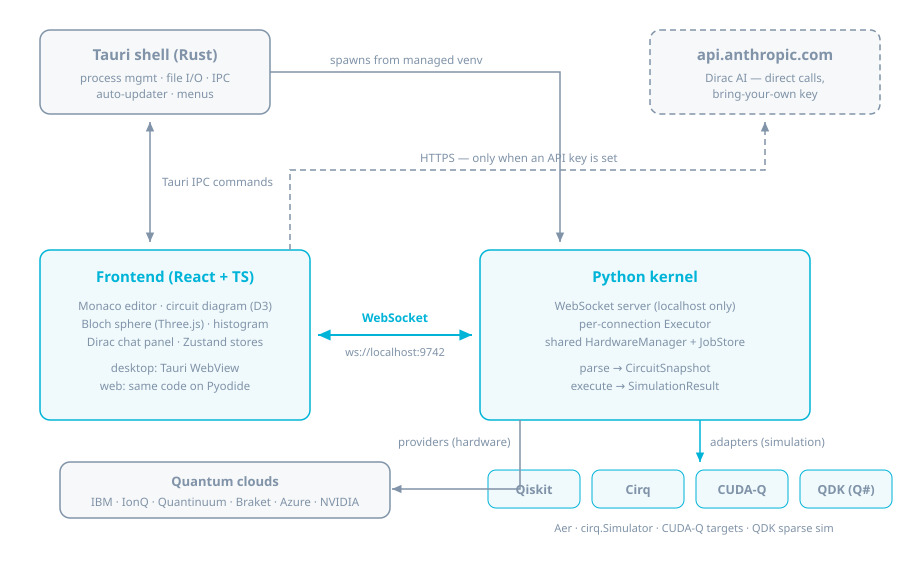

Nuclei is three processes pretending to be one app: a Rust shell, a React
frontend in the shell's WebView, and a Python kernel subprocess. The
frontend never touches Python directly — everything quantum goes over a
localhost WebSocket. Dirac (the AI layer) never touches a Nuclei server —
the frontend calls `api.anthropic.com` directly with a user-supplied key.

## The three layers

| Layer | Code | Responsibilities |
|-------|------|------------------|
| Tauri shell (Rust) | `src-tauri/` | Spawns and supervises the kernel process, manages the per-user Python venv, file system access, typed IPC commands, auto-updater, native menus |
| Frontend (React + TypeScript) | `src/` | Monaco editor, D3 circuit diagram, Three.js Bloch sphere, histogram, Dirac chat, Zustand stores. Also ships as the browser build — see [desktop vs web](/docs/introduction/desktop-vs-web/) |
| Python kernel | `kernel/` | WebSocket server, framework detection, adapters that normalize circuits to `CircuitSnapshot`, simulation, hardware submission |

## Critical path

{/* Debounce default: src/stores/settingsStore.ts:26-31 (parseDebounceMs: 300); handlers: kernel/server.py:185-230 */}

1. You type in Monaco. After a debounce (default 300 ms, configurable in
   Settings → Kernel), the frontend sends `{type: "parse", code, language}`
   over the WebSocket.
2. The kernel resolves an adapter — explicit `language` hint first, then
   regex detection on the source (Q# syntax is checked before Python
   imports) — and extracts a [`CircuitSnapshot`](/docs/kernel-api/schemas/#circuitsnapshot):
   gate list, qubit count, depth. **No simulation runs on parse.**
   {/* kernel/executor.py:26-62, 99-123 */}
3. The frontend re-renders the circuit diagram from the snapshot. This loop
   runs on every pause in typing.
4. On Cmd+Enter (Ctrl+Enter), the frontend sends `{type: "execute", code,
   shots, language}`. The kernel runs the full simulation and replies with a
   [`SimulationResult`](/docs/kernel-api/schemas/#simulationresult) —
   statevector, probabilities, sampled counts, per-qubit Bloch coordinates.
5. The Bloch sphere and histogram panels update from the result.

Message-by-message detail lives in the
[Kernel API reference](/docs/kernel-api/overview/).

## Process model

{/* Spawn: src-tauri/src/commands/kernel.rs:77-207; venv: frameworks.rs:341-364 */}

- **Spawn.** On startup the shell runs `ensure_kernel_runtime`: create the
  managed venv if missing, rebuild it if its Python is older than 3.10,
  install the kernel's import-time deps (`websockets`, `numpy`, `keyring`)
  if absent — then launches `kernel/server.py` with the venv's interpreter.
  If the venv can't be bootstrapped it falls back to system `python3`.
  See [install & build](/docs/introduction/install-and-build/#the-managed-python-venv)
  for the venv lifecycle.
- **Port.** The kernel binds `localhost` and prints exactly one ready line
  to stdout: `Nuclei kernel ready on ws://localhost:<port>`. Standalone
  embedders should parse that line — the kernel scans 9742–9761 if the
  default port is taken. The desktop app instead *pins* 9742: the shell
  kills any process squatting on the port before spawning, because the
  frontend's WebSocket URL and the CSP both hardcode it.
  {/* server.py:496-513; kernel.rs:14, 49-75, 96; tauri.conf.json:25 */}
- **Connection.** JSON text frames, 1 MiB inbound cap, WebSocket ping every
  30 s with a 20 s pong timeout. {/* server.py:16-18, 485-492 */}
- **Isolation.** Each connection gets its own `Executor` — parse/execute
  state never bleeds between clients. The `HardwareManager` (provider
  connections, job registry) is deliberately process-global, shared across
  connections. {/* server.py:20-23, 163-167 */}
- **Logging.** Kernel stdout/stderr are drained into the shell's log file,
  so a kernel crash leaves a trace (see
  [configuration](/docs/reference/configuration/#file-locations) for log
  paths). {/* kernel.rs:188-201 */}

## Where extension code plugs in

| You want to | Touch | Guide |
|-------------|-------|-------|
| Support a new quantum framework | `kernel/adapters/` + the Rust catalog | [Framework adapters](/docs/extending/framework-adapters/) |
| Submit to a new hardware cloud | `kernel/hardware/` | [Hardware providers](/docs/extending/hardware-providers/) |
| Drive the kernel from outside Nuclei | nothing — speak the protocol | [Kernel API](/docs/kernel-api/overview/) |
| Change Dirac's behavior | `src/hooks/useDirac.ts` + `src/services/` | [Dirac architecture](/docs/dirac/architecture/) |
